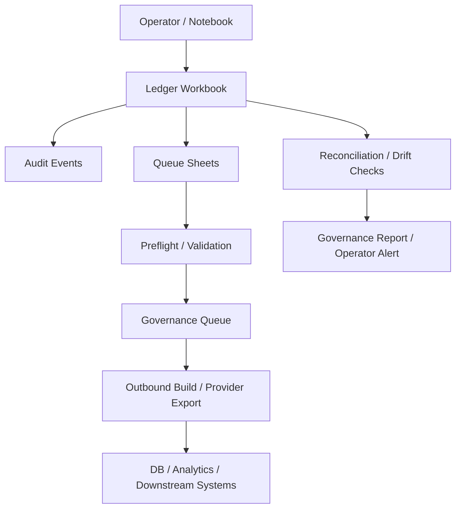

# DPO Data Flows and Implementation Map

This document translates the DTO doctrine into concrete data flows that are grounded in the current DPO implementation. It uses the existing modules in the workspace as the implementation anchors.

## 1. Core Domain Boundaries

- Workflow domain: the ledger workbook and its queue sheets
- Client domain: confidential client operational data handled through protected surfaces
- Machine domain: the database-backed processing and analytics path
- Governance domain: the notebook/orchestrator layer and reconciliation checks

## 2. Primary Data Flow Overview

## 3. Flow A: Repo and Workflow Intake

### Purpose

Bring repository and workflow state into the operator ledger so the notebook and operators can act on structured workflow truth.

### Current implementation anchors

- [dpo_system/src/phase_runner.py](dpo_system/src/phase_runner.py)
- [dpo_system/src/ledger_io.py](dpo_system/src/ledger_io.py)
- [dpo_system/src/operator_actions.py](dpo_system/src/operator_actions.py)

### Flow

1. The phase runner loads the repo manifest.
2. It compares desired repo state to the existing ledger rows.
3. It creates or updates rows in the REPO_STATE sheet.
4. Operator actions write auditable events through the operator action layer.
5. The notebook can review the resulting workflow state from the ledger.

### Data shape

- REPO_STATE rows: repository metadata, status, last commit, enabled flag
- OPERATOR_LOG and LEDGER_EVENTS: operator actions and workflow events

### Design rule

The ledger remains the starting point for workflow state. The DB and downstream systems may reflect the data, but they do not define the workflow truth.

---

## 4. Flow B: Queueing Operator Work

### Purpose

Create structured queue state for ingestion, clause review, CRM follow-up, and governance tasks.

### Current implementation anchors

- [dpo_system/src/operator_actions.py](dpo_system/src/operator_actions.py)
- [dpo_system/src/ledger_io.py](dpo_system/src/ledger_io.py)

### Flow

1. Operator actions create queue rows in the appropriate sheet.
2. The queue row includes status, priority, created timestamp, workflow id, and notes.
3. The notebook or operator can update status later through the same ledger path.
4. Audit events are generated for the action.

### Queue sheets

- INGESTION_QUEUE
- CLAUSE_QUEUE
- CRM_QUEUE
- GOVERNANCE_QUEUE

### Design rule

Queue state is workflow state. It should be created and updated through the ledger layer first, then mirrored outward if needed.

---

## 5. Flow C: CSF Seed Ingestion and Governance

### Purpose

Take a CSF seed source file, validate it, and create governed workflow entries for outbound review.

### Current implementation anchors

- [dpo_system/src/csf_ingest.py](dpo_system/src/csf_ingest.py)
- [dpo_system/src/preflight_validator.py](dpo_system/src/preflight_validator.py)
- [dpo_system/src/phase_runner.py](dpo_system/src/phase_runner.py)
- [dpo_system/src/ooma_dialer.py](dpo_system/src/ooma_dialer.py)

### Flow

1. The seed CSV is read and normalized into a contact-like structure.
2. The preflight validator checks row count, headers, IDs, and registry rules.
3. If validation passes, the governance queue is populated with a workflow entry.
4. If validation fails, the flow is blocked and a preflight report is written.
5. The notebook can review the report and decide whether to proceed.

### Data products

- preflight report JSON
- record ID registry
- governance queue rows
- audit evidence for operator decisions

### Design rule

The ledger-backed governance queue is the control surface for batch progression. Validation failures stop progression.

---

## 6. Flow D: Outbound Build and Provider Export

### Purpose

Build outbound batches from available export data and prepare them for downstream provider output.

### Current implementation anchors

- [dpo_system/src/db_outbound_builder.py](dpo_system/src/db_outbound_builder.py)
- [dpo_system/src/list_builder.py](dpo_system/src/list_builder.py)
- [dpo_system/src/ooma_dialer.py](dpo_system/src/ooma_dialer.py)
- [dpo_system/src/phase_runner.py](dpo_system/src/phase_runner.py)

### Flow

1. Export rows are read from source data.
2. The outbound builder normalizes them into standard row structure.
3. Batches are created with deterministic file manifests.
4. Preflight validation is run per batch.
5. Provider-ready exports are produced for downstream channels.

### Data products

- outbound batch CSV files
- batch manifest
- provider-ready outbound exports
- record ID registry entries

### Design rule

Outbound generation should be deterministic and should only proceed when the governance gate says the batch is valid.

---

## 7. Flow E: Approval, Rejection, and Audit

### Purpose

Capture operator decisions in an auditable way and prevent duplicate or conflicting writes.

### Current implementation anchors

- [dpo_system/src/operator_actions.py](dpo_system/src/operator_actions.py)
- [dpo_system/src/audit_writer.py](dpo_system/src/audit_writer.py)

### Flow

1. An operator approves or rejects a batch.
2. The action emits an event with a deterministic idempotency key.
3. The event is written to the audit log.
4. If the same action is repeated, it is treated as a duplicate or conflict depending on payload identity.

### Design rule

Every meaningful operator decision should have a durable audit event. The audit layer is the enforcement harness for control and balance.

---

## 8. Flow F: Reconciliation and Governance Checks

### Purpose

Ensure cross-domain integrity between workflow state, downstream outputs, and operational surfaces.

### Current implementation anchors

- [dpo_system/src/workflow_replay.py](dpo_system/src/workflow_replay.py)
- [dpo_system/src/sync_status.py](dpo_system/src/sync_status.py)
- [dpo_system/src/exception_report.py](dpo_system/src/exception_report.py)
- [dpo_system/src/kpi_summary.py](dpo_system/src/kpi_summary.py)

### Flow

1. The notebook or operator reads current ledger and downstream state.
2. The system compares expected state to actual state.
3. It flags drift, conflict, staleness, or integrity risk.
4. A governance report or operator alert is produced.

### Design rule

Reconciliation should prevent silent divergence. It is the mechanism that keeps the ledger-led posture honest.

---

## 9. Recommended Implementation Sequence

1. Preserve the existing ledger workbook as the workflow control layer.
2. Keep the notebook as the orchestration and reconciliation layer.
3. Introduce a thin adapter layer for DB sync and downstream mirror updates.
4. Use the current audit writer as the durable guardrail for operator decisions.
5. Keep the sheet and Shadow CRM as controlled operational surfaces, not independent authorities.

## 10. Concrete Next Build Targets

The next implementation layer should focus on:

- a ledger-to-DB sync adapter,
- a DB-to-ledger reconciliation routine,
- an RSS-to-enrichment adapter that turns filing feeds into scraper targets for phone discovery,

## 11. Flow G: RSS Filing Intake to Phone Enrichment

### Purpose

Treat SEC and similar RSS feeds as the fastest discovery lane for fresh filing entities, while explicitly recognizing that these feeds are not dialer-ready because they do not carry phone numbers.

### Current implementation anchors

- [dpo_system/src/regd_scraper_pack.py](dpo_system/src/regd_scraper_pack.py)
- [dpo_system/src/operator_actions.py](dpo_system/src/operator_actions.py)
- [dpo_system/src/phase_runner.py](dpo_system/src/phase_runner.py)

### Flow

1. The RSS scraper pulls newly published regulatory filing entries.
2. The scraper normalizes each filing into a contract-shaped filing record.
3. The scraper also writes enrichment target rows for downstream phone-discovery scrapers.
4. Those scrapers resolve issuer contact details, especially phone numbers, from web and corporate sources.
5. Only after enrichment succeeds should the lead move into outbound batch construction for provider export.

### Data products

- filing evidence CSV and JSONL artifacts
- enrichment target CSV with `pending_phone_lookup` status
- downstream scraper evidence linking filing source to discovered contact data

### Design rule

RSS is the speed lane for discovery, not the final outbound source of truth. A filing sourced from RSS must pass through enrichment before it is eligible for Ooma or any other dialer export.
- a conflict-resolution policy,
- and a protected client-data boundary layer.

These are the natural successors to the existing workflow, audit, and preflight modules.

---

## 11. Automation Mode Execution Plan

### Objective

Move from workflow orchestration to regulated automation by binding the ledger, taxonomy layer, Docassemble generation, and audit trail into one deterministic operating loop.

### Phase 1: Canonical transaction layer

- Define a canonical transaction schema for legal-reasoning events, reporting obligations, and operator actions.
- Normalize inbound facts from the ledger, CRM, and other sources into one transaction model.
- Tag each transaction with jurisdiction, taxonomy family, reporting trigger, and operator ownership.
- Store the canonical record in the ledger first, then mirror it to the machine layer.

### Phase 2: Taxonomy and rules layer

- Create a structured taxonomy mapping layer for EESM, DTCC, SEC, EDGAR, XBRL, and related reporting concepts.
- Maintain mapping tables for transaction type, role, event, function, and reporting output.
- Use the notebook or a thin adapter to classify and route each transaction to the right output path.

### Phase 3: Docassemble generation layer

- Wire structured facts from the ledger into Docassemble templates and generation steps.
- Produce legal and regulatory output drafts from the canonical transaction model.
- Insert an operator approval gate before finalization or submission.

### Phase 4: Audit and governance layer

- Record every generation event, rule selection, template version, and approval decision in the audit trail.
- Use the existing audit writer and ledger event flow as the enforcement point.
- Reconcile generated output back to the source transaction record before release.

### Phase 5: Reporting and submission layer

- Package approved outputs into submission-ready bundles.
- Track submission state, version history, and evidence references in the ledger.
- Keep the notebook as the reconciliation and oversight layer across all generated artifacts.

### Immediate build targets

1. Add a canonical transaction schema and normalization adapter.
2. Add a taxonomy mapping seed file and rule-routing logic.
3. Wire Docassemble to the existing workflow path in [dpo_system/src/phase_runner.py](dpo_system/src/phase_runner.py).
4. Extend [dpo_system/src/operator_actions.py](dpo_system/src/operator_actions.py) with automation approval and release actions.
5. Use [dpo_system/src/audit_writer.py](dpo_system/src/audit_writer.py) as the durable audit backbone.
6. Treat [docassemble/docker-compose.yml](docassemble/docker-compose.yml) as the execution surface for the generation layer.

### Automation mode doctrine

- The ledger governs the workflow.
- The taxonomy layer governs meaning.
- Docassemble governs output generation.
- The audit trail proves what happened.
- The notebook governs reconciliation and operator oversight.
